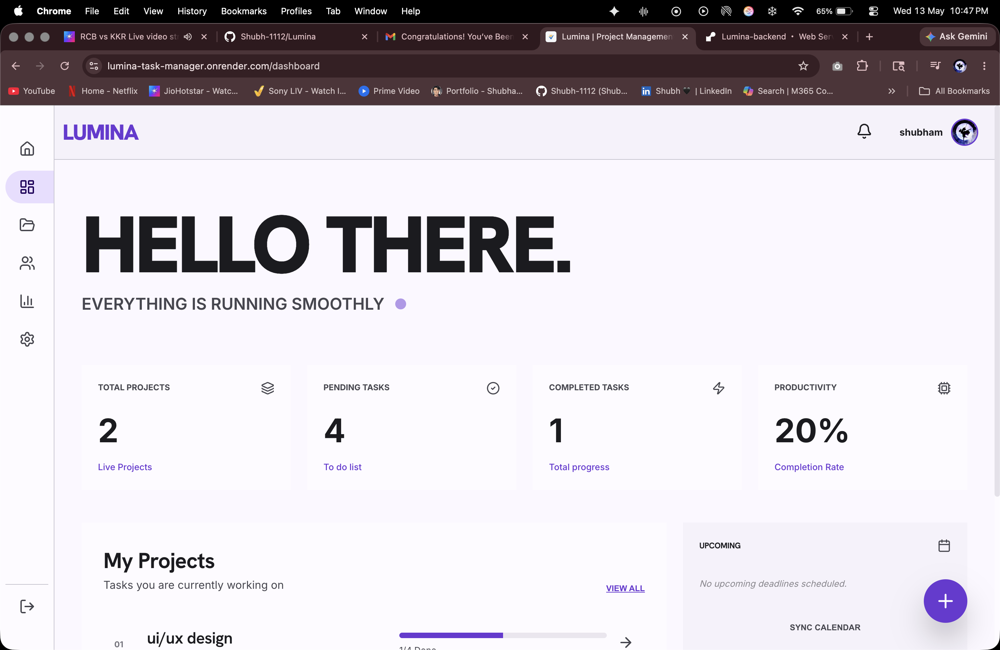
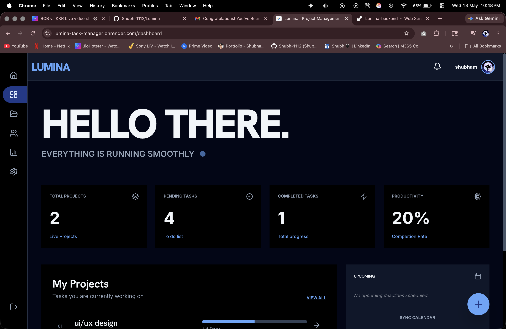
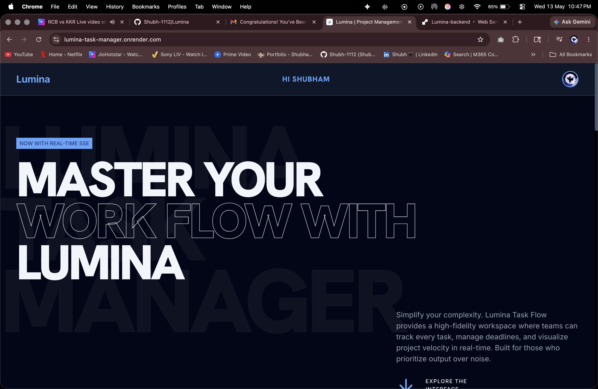
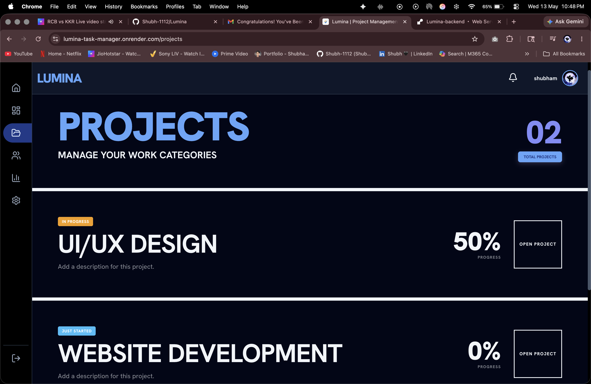

# Lumina — Collaborative Project Management

**Lumina** is a premium, high-performance project management platform built for modern teams. It combines a striking "Brutalist" aesthetic with powerful collaboration features, real-time synchronization, and advanced analytics.

[**🚀 View Live App**](https://lumina-task-manager.onrender.com/)

---

## 📸 Gallery

### **The Landing Page**
A high-fidelity landing page that introduces the "Modern Brutalist" design language and core value proposition.


### **Interactive Dashboard**
Real-time task tracking with dark and light mode support. Features dynamic analytics for project velocity.
<p align="center">
  
  
</p>

### **Project View**
Manage multiple projects with bold visual hierarchy and clear progress tracking.


---

## ✨ Key Features

-   **🚀 Real-time Collaboration**: Instant updates via Server-Sent Events (SSE). No manual refreshing needed.
-   **📊 Advanced Analytics**: Detailed project metrics, member workload tracking, and completion trends.
-   **🔐 Role-Based Access Control (RBAC)**: Flexible permissions for Admins, Managers, and Members.
-   **✅ Dynamic Task Management**: Automatic priority escalation near deadlines, task assignments, and status tracking.
-   **🔔 Smart Notifications**: Live alerts for new tasks, role changes, and project join requests.
-   **🔗 Seamless Onboarding**: Invite links with auto-join requests and Google OAuth integration.
-   **🎨 Brutalist Design**: A unique, high-contrast UI with smooth GSAP and Framer Motion animations.

---

## 🛠 Tech Stack

### Frontend
-   **React 19** (Vite)
-   **Tailwind CSS 4** (Modern Brutalist styling)
-   **GSAP & Framer Motion** (Micro-interactions & animations)
-   **React Router 7** (State-aware navigation)
-   **Lucide React** (Iconography)

### Backend
-   **FastAPI** (Python 3.10+)
-   **MongoDB** (Motor for async operations)
-   **JWT & Google OAuth** (Secure authentication)
-   **Pydantic V2** (Robust data validation)
-   **SSE** (Native real-time event streaming)

---

## 🚀 Getting Started

### Prerequisites
-   Python 3.10+
-   Node.js 18+
-   MongoDB instance (local or Atlas)

### Backend Setup
1.  Navigate to the `backend` directory.
2.  Install dependencies:
    ```bash
    pip install -r requirements.txt
    ```
3.  Create a `.env` file based on `.env.example`:
    ```env
    MONGO_URI=mongodb+srv://...
    JWT_SECRET=your_super_secret_key
    FRONTEND_URL=http://localhost:5173
    GOOGLE_CLIENT_ID=your_google_client_id
    ```
4.  Run the server:
    ```bash
    uvicorn app.main:app --reload
    ```

### Frontend Setup
1.  Navigate to the `frontend` directory.
2.  Install dependencies:
    ```bash
    npm install
    ```
3.  Create a `.env` file:
    ```env
    VITE_API_URL=http://localhost:8000/api
    VITE_GOOGLE_CLIENT_ID=your_google_client_id
    ```
4.  Run the development server:
    ```bash
    npm run dev
    ```

---

## 📖 API Documentation

Detailed API documentation is available in the [api.md](./api.md) file.
You can also access the interactive Swagger docs at:
-   `http://localhost:8000/api/docs` (Swagger UI)
-   `http://localhost:8000/api/redoc` (ReDoc)

---

## 🎨 Design Language

Lumina uses a **Modern Brutalist** design philosophy:
-   **Contrast**: Deep purples (`#0F0720`) paired with vibrant primary colors and sharp white text.
-   **Typography**: Bold, oversized headings and high-readability body text.
-   **Geometry**: Square edges, heavy borders, and deliberate use of whitespace.
-   **Motion**: GSAP-powered transitions for a tactile, responsive feel.

---

## 📄 License

This project is licensed under the MIT License.
